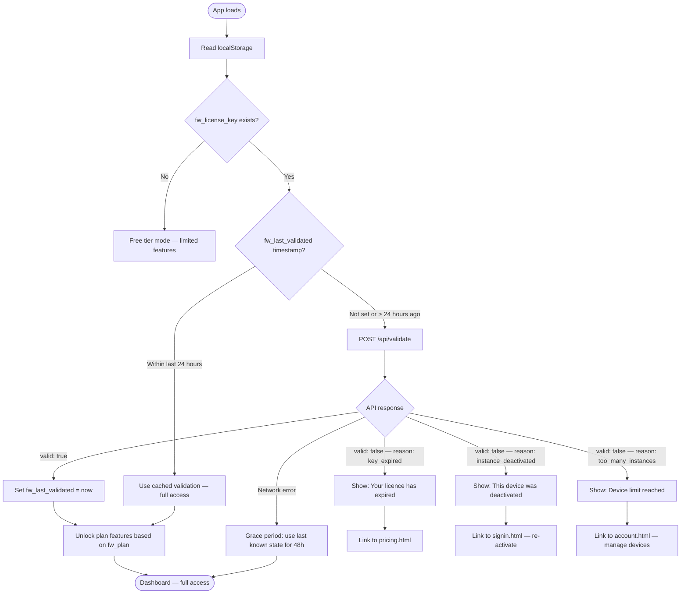
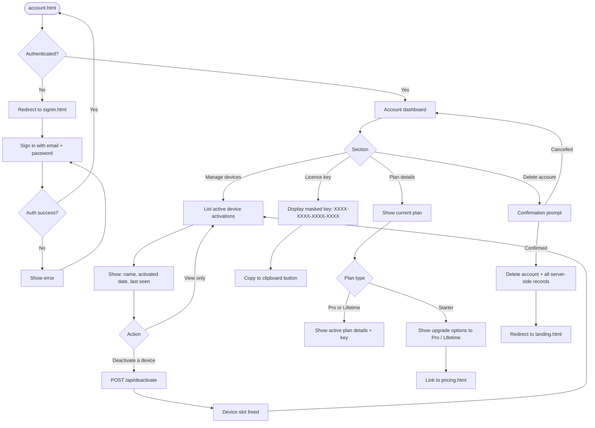
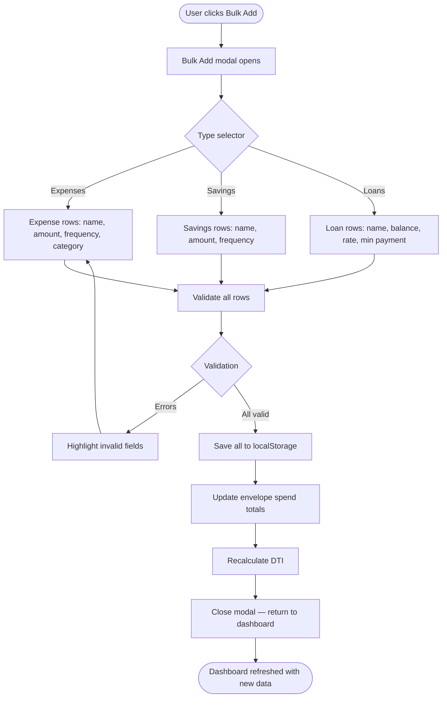
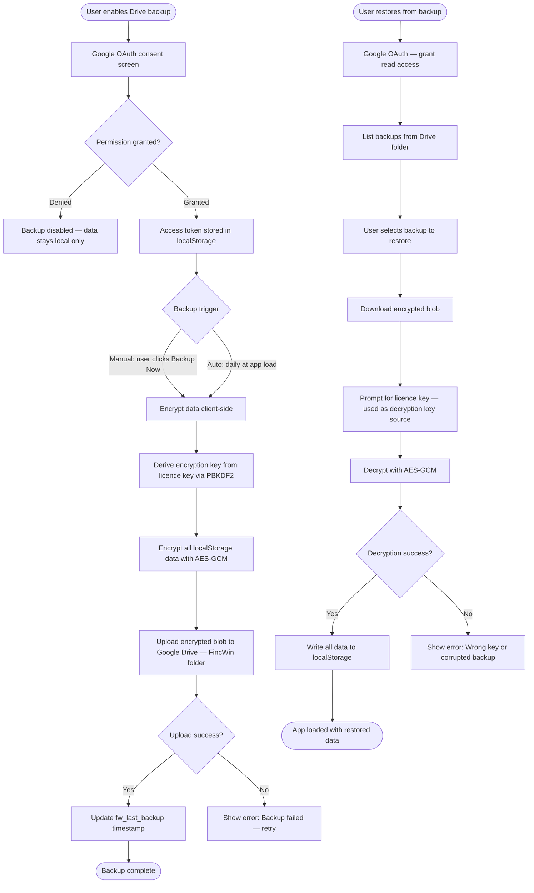

# FincWin — User Journey Flowcharts

## 1. Marketing Funnel

```mermaid
flowchart TD
    A([Discovery]) --> B{Channel}
    B -->|Organic search| C[landing.html]
    B -->|Paid ad — debt focus| D[v3.html]
    B -->|Paid ad — anxiety focus| E[v2.html]
    B -->|Paid ad — wealth focus| F[v4.html]
    B -->|Direct link| C

    C --> G{User intent}
    D --> G
    E --> G
    F --> G

    G -->|Wants more detail| H[features.html]
    G -->|Ready to buy| I[pricing.html]
    G -->|Just wants the app| J[index.html]

    H --> I
    I --> K{Decision}

    K -->|Try free first| J
    K -->|Buy Starter $49| L[Lemon Squeezy Checkout]
    K -->|Buy Pro $89| L
    K -->|Buy Lifetime $149| L

    L --> M[Email: licence key delivered]
    M --> N[signin.html?key=XXXX]
    N --> O[/api/activate]
    O --> P{Activation result}
    P -->|Success| J
    P -->|Error| N

    J --> Q([App — core experience])
```

---

## 2. App Internal Flow

```mermaid
flowchart TD
    A([App loads — index.html]) --> B{PIN set?}

    B -->|Yes| C[PIN entry screen]
    B -->|No| D{Licence in localStorage?}

    C --> E{PIN correct?}
    E -->|Yes| D
    E -->|No| F[Show error, retry]
    F --> C

    D -->|Yes — key exists| G[/api/validate — daily check]
    D -->|No — free tier| H[Dashboard — Free features]

    G --> I{Valid?}
    I -->|Yes| J[Dashboard — Full feature set]
    I -->|No| K[Licence invalid screen]
    K --> L[signin.html — re-activate]

    H --> M{Tab navigation}
    J --> M

    M -->|Expenses tab| N[Expense Tracker]
    M -->|Budget tab| O[Envelope View]
    M -->|Loans tab| P[Loan Payoff Tracker]
    M -->|Savings tab| Q[Savings Goals]
    M -->|Analytics tab| R[Spending Heatmap + DTI]
    M -->|AI Coach tab| S{Plan check}

    S -->|Pro or Lifetime| T[AI Coach interface]
    S -->|Starter / Free| U[Upgrade prompt]

    N --> V[Add expense modal]
    N --> W[Bulk Add modal]
    O --> X[Set envelope amounts]
    O --> Y[View fill status per category]
    P --> Z[Enter loan details]
    P --> AA[View amortisation schedule]
    P --> AB[Model extra payments]
    Q --> AC[Set savings goal]
    Q --> AD[Log contribution]
```

---

## 3. Licence Validation Flow



---

## 4. Account Management Flow



---

## 5. Bulk Add Flow (in-app)



---

## 6. Google Drive Backup Flow (Pro / Lifetime)


